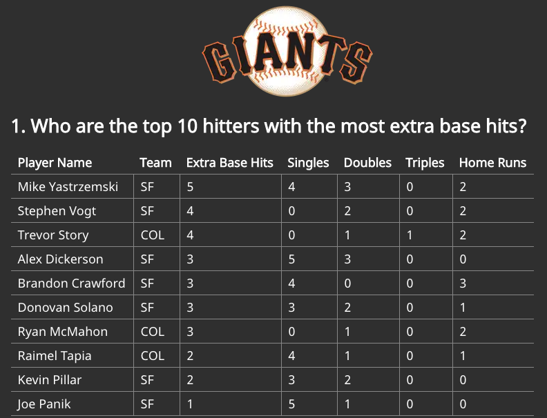

[![LinkedIn][linkedin-shield]][linkedin-url]
</br>

# San Francisco Giants Project - [https://giants.netlify.app](https://giants.netlify.app)

<!-- TABLE OF CONTENTS -->
<details open="open">
  <summary>Table of Contents</summary>
  <ol>
    <li>
      <a href="#about-the-project">About The Project</a>
      <ul>
        <li><a href="#built-with">Built With</a></li>
      </ul>
    </li>
    <li>
      <a href="#getting-started">Getting Started</a>
      <ul>
        <li><a href="#prerequisites">Prerequisites</a></li>
        <li><a href="#installation">Installation</a></li>
      </ul>
    </li>
    <li><a href="#usage">Usage</a></li>
    <li><a href="#contact">Contact</a></li>
  </ol>
</details>

<!-- ABOUT THE PROJECT -->
## About The Project

Analyze play by play baseball data to answer statistical questions.

### Built With

* [Python](https://www.python.org)
* [Pandas](https://pandas.pydata.org)
* [React](https://reactjs.org)
* [Gatsby](https://www.gatsbyjs.com)

<!-- GETTING STARTED -->
## Getting Started

### Prerequisites

* Python - [Download and install](https://www.python.org/downloads)
* Pandas - [Download and install](https://pandas.pydata.org/getting_started.html)
    * Note: if you don't want to install Pandas, try [JupyterLab](https://mybinder.org/v2/gh/jupyterlab/jupyterlab-demo/master?urlpath=lab/tree/demo), which runs Python and Pandas in the cloud
* Gatsby - [Download and install](https://www.gatsbyjs.com/docs/quick-start/)
    * Note: if you don't want to install Gatsby, you can view a running version [here](https://giants.netlify.app).

### Running the analytics

In a terminal, run:
   ```sh
   cd source
   python3 munge.py
   ```
This command will output six CSVs with baseball statistics in `source/csv`

### Running the website
1. In a terminal, run:
    ```sh
    cd source/web
    gatsby develop
    ```
2. Visit the following address in any browser:
   ```
   http://0.0.0.0:8000
   ```

<!-- CONTACT -->
## Contact

Tyler Coleman - tylerdc@hey.com - tylerdc.co


<!-- MARKDOWN LINKS & IMAGES -->
<!-- https://www.markdownguide.org/basic-syntax/#reference-style-links -->
[linkedin-shield]: https://img.shields.io/badge/-LinkedIn-black.svg?style=for-the-badge&logo=linkedin&colorB=555
[linkedin-url]: https://linkedin.com/in/tycol